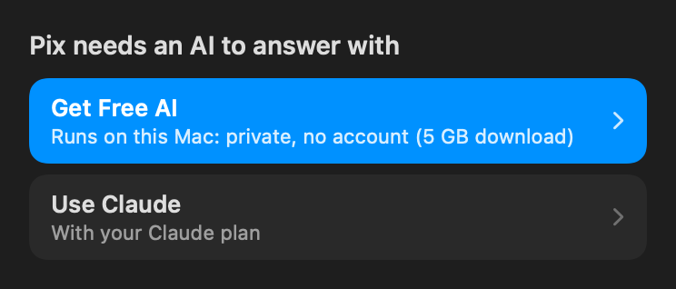

<div align="center">


# Pix

**The free helper that lives on the edge of your Mac's screen.**
Ask it anything, or tell it to do something. It answers, explains, and does it in your apps, with Undo on everything.

[](https://github.com/LED-esma/pix/releases/latest)
[](LICENSE)


</div>

---

| Start | Learn | Features | Project |
|---|---|---|---|
| [Works the second you install it](#works-the-second-you-install-it) | [The promise](#the-promise) | [What Pix does](#what-pix-does) | [Tech stack](#tech-stack) |
| [Quick start](#quick-start) | [Why Pix](#why-pix) | [The AIs](#the-ais) | [Documentation](#documentation) |
| [Build from source](#build-from-source) | [Safety by design](#safety-by-design) | [Your apps and the web](#your-apps-and-the-web) | [Contributing](#contributing) |
| [Where it runs](#where-it-runs) | [Private and local-first](#private-and-local-first) | [Tools Pix makes](#tools-pix-makes) | [License](#license) |

---

## Works the second you install it

No keys, no accounts, no settings.

1. **Download** Pix from [Releases](https://github.com/LED-esma/pix/releases/latest) and drag it to Applications.
2. **Open it.** A purple blob appears at the edge of your screen.
3. **Ask.** Click it (or press Control-Option-Space) and type, or hold the shortcut and talk.

On a Mac with Apple Intelligence, Pix answers with **the AI built into macOS**: free, private, on your Mac. On any other Mac, one button, **Get Free AI**, downloads an AI that runs on your Mac, with a progress bar. If you have a Claude plan, **Use Claude** makes Pix its best.

<div align="center"></div>

---

## The promise

| | |
|---|---|
| **Free for real** | The whole app is free and open source (MIT). It runs on the AI built into macOS or one on your Mac; nothing to pay for, nothing to sign up for. |
| **Does, not just answers** | Reminders, calendar, notes, timers, files, settings, windows, websites, and clicking through your apps, not just text about how to. |
| **Undo, not "are you sure?"** | Every change shows on the card with Undo. Only what can't be taken back (sending, buying, deleting, running a script) asks first. |
| **Explains like a tutor** | Step-by-step walkthroughs with real math, live graphs, physics simulations and diagrams, pointing at each part as it goes. |
| **Better with what you already pay for** | Bring Claude, or any AI service, and Pix uses it, falling back down your list when one can't answer. |
| **Private by default** | The free AIs run on your Mac. Pix looks at your screen or listens only when you ask. |

---

## Why Pix

| The everyday pain | What Pix does |
|---|---|
| Switching to a browser tab to ask an AI, then copying the answer back | It's already on your screen; one click or shortcut |
| AI that says "here's how" instead of doing it | Pix adds the reminder, moves the files, flips the setting, with Undo |
| Explanations that are a wall of text | Walkthroughs with steps, live graphs and simulations on a board |
| "Where is that setting?" | **Show Me**: Pix flies to the button and points at it, then waits for your click |
| A messy Downloads folder | One sentence, and it's sorted by class and type, with one Undo |
| AI apps that need a key, an account or a subscription | Free on your Mac out of the box |
| Small AIs that make math mistakes | Pix works out the numbers itself |
| Fear of an AI deleting something | Irreversible actions always ask; Pix can't move your home folders, Library or hidden folders at all |

---

## What Pix does

- **Ask or tell it.** Type and press Return, or hold the shortcut and talk. Say "Hey Pix" if you turn it on.
- **School.** "what's due this week?" (with Canvas connected), "explain the chain rule with a graph", "walk me through 2x² − 8x + 6 = 0".
- **Your Mac.** Reminders, Calendar, Notes, Shortcuts, timers ("ping me in 25 minutes"), scheduled questions ("every weekday at 8 tell me what's due"), files (organize, move, zip, find duplicates), settings (dark mode, Wi-Fi, wallpaper), windows (side by side, full screen).
- **Explaining.** Answers come formatted (math, tables, code), and a pop-up **board** shows 2D and 3D graphs, physics simulations, charts, flowcharts and runnable Python when they help.
- **Developers.** Call Pix from a terminal or code editor and it brings that project's folder, git state and recent output along: explain code, fix a bug (with Undo), write a commit message.
- **Memory.** It remembers useful things you mention ("I'm taking Calc 3"), and you can see or forget them in Settings.
- **Hide it your way.** Blob, edge pill, just eyes, glow sliver, corner, menu bar or notch; it can sleep when idle and vanish while you present.

The full list of what Pix can do on your Mac: [docs/TOOLS.md](docs/TOOLS.md).

### Your apps and the web

- **Do It:** "turn on dark mode for me", "put Safari and Notes side by side". Pix clicks and types in the app in front; a ring and a label show where it's working.
- **Show Me:** "show me how to export this". Pix flies to each button, points at it with the step, and waits for your click.
- **Websites:** Pix reads pages in Safari and Chrome as text, digs through sites in its own browser window, and hands you the keyboard at a sign-in.
- **Visual apps** (CAD, games, drawing canvases): with Claude, Pix takes a picture of the window and clicks, drags or points by position.

### Tools Pix makes

"Make a tool that counts the files in my Downloads" builds a recipe from Pix's tools, AppleScript or shell commands, tests it, and saves it. Run it by typing its name.

---

## The AIs

Pix runs on whatever you have, in this order unless you rearrange it in **Settings → AI**. When one can't answer (or a question is beyond it), the next one does, and the card says who answered.

| AI | Cost | Setup |
|---|---|---|
| **Built into macOS** (Apple Intelligence) | Free, private | None: Pix starts on it |
| **Free AI on your Mac** (Ollama, LM Studio, llama.cpp) | Free, private | One click: **Get Free AI** |
| **Claude** (your Pro or Max plan) | Your plan | **Use Claude**; best at doing things, adds research teams |
| **Any AI service** (Gemini, OpenAI, Groq, OpenRouter, DeepSeek, Mistral, xAI, Cerebras, or your own) | Free tiers or your plan | Settings → AI: paste a key, or **Sign In with OpenRouter** |

Free AIs run on **Pix's own engine**, so they need nothing else installed. Claude runs through [Claude Code](https://code.claude.com), which Pix installs for you (no admin password), because Claude plans only work there. OpenAI-style services go through a tiny translator inside Pix; keys stay in your Keychain. More in [docs/AI.md](docs/AI.md).

---

## Safety by design

- **Undo for everything reversible**: reminders, events, notes, timers, file moves, settings, window changes, project edits.
- **Asks before anything that can't be taken back**: sending, buying, deleting, signing in, running scripts and Shortcuts, moving files to the Trash. Auto Mode skips questions, but never these.
- **Never touches** your home folder's own folders, Library or hidden folders, and never types passwords or payment details.
- **Content isn't instructions**: text Pix reads in files, pages and screens is labeled as data, so a planted "delete everything" stays text.
- **App settings are changed in the app**, the way you would, and checked afterwards.

How it works and how it's tested: [docs/SAFETY.md](docs/SAFETY.md).

---

## Private and local-first

- The built-in AI and the free AI on your Mac never send your questions anywhere.
- Pix looks at your screen and listens only when you ask. "Hey Pix", if you turn it on, is recognized on your Mac.
- Keys live in your Keychain. Answers are saved as Markdown in `~/Pix/runs`, on your Mac.
- No analytics, no account, no server of ours.

Exactly what goes where: [PRIVACY.md](PRIVACY.md).

---

## Quick start

1. Download **Pix.dmg** from [Releases](https://github.com/LED-esma/pix/releases/latest) (signed and notarized by Apple), open it, and drag Pix to Applications.
2. Open Pix. It opens at login from now on (turn that off in Settings).
3. **Pick your AI.** Pix lists the AIs your Mac can use, each with what it's best at, what it costs, where your words go and how fast it is, and the best one is already picked. If you choose Claude and it isn't on your Mac yet, Pix sets it up and opens the sign-in.
4. Click the blob or press **Control-Option-Space**, and try one of the four examples on the welcome card.
5. macOS asks for each permission the first time Pix needs it (Reminders, Calendar, Accessibility to use your apps, Screen Recording to see them, the microphone to talk). **Settings → Permissions** lists them.

Pix keeps itself up to date: new versions download in the background, are checked to be signed by the same developer, and install while Pix is idle. The card then says "Updated to Pix …" with a link to what's new. Prefer to choose? Turn off **Update Automatically** in Settings → General, and Pix tells you when a version is out.

---

## Build from source

```bash
brew install xcodegen
git clone https://github.com/LED-esma/pix.git && cd pix
tools/fetch-plugins.sh     # the board's libraries (~21 MB, pinned versions)
./build.sh                 # builds a universal app into dist/ and runs the self-check
./build.sh --install       # same, then installs to /Applications
```

Without a Developer ID certificate, `build.sh` signs ad hoc: everything works, but macOS asks for Screen Recording and Accessibility again after each rebuild. `tools/package.sh` makes a notarized disk image. The architecture tour is in [docs/ARCHITECTURE.md](docs/ARCHITECTURE.md).

---

## Where it runs

| Mac | Pix | Built-in AI |
|---|---|---|
| Apple silicon, macOS 26 or later, Apple Intelligence on | Yes | Yes |
| Apple silicon, macOS 15 | Yes | No: one-click free AI on your Mac |
| Intel, macOS 15 or later | Yes (universal app) | No: one-click free AI (a smaller model) |

---

## Tech stack

| Layer | Technology |
|---|---|
| App | Swift 5, AppKit + SwiftUI, xcodegen; universal (arm64 + x86_64) |
| Engine | Pix's own agent loop over the Messages API; Claude via Claude Code headless |
| Built-in AI | Apple FoundationModels (on-device), with runtime tool schemas |
| Tools | Pix's MCP server (`Pix --mcp`, 57 tools), reached in-app through a token-guarded 127.0.0.1 bridge |
| Free AI on your Mac | Ollama, LM Studio, llama.cpp |
| Screen | Accessibility (text, cheap) and ScreenCaptureKit (pictures, on Claude) |
| Voice | Speech framework (on-device recognition), AVSpeechSynthesizer |
| Board | KaTeX, three.js, Chart.js, Mermaid, Matter.js, cannon-es, anime.js, Pyodide, all offline |
| Tests | 175 self-checks run on every build (`Pix --selfcheck`), plus end-to-end suites in `bench/` |

---

## Documentation

| Document | What's in it |
|---|---|
| [docs/ARCHITECTURE.md](docs/ARCHITECTURE.md) | How Pix is put together, file by file |
| [docs/AI.md](docs/AI.md) | The AIs, the engine, failover, adding your own |
| [docs/TOOLS.md](docs/TOOLS.md) | Every tool Pix can use on your Mac |
| [docs/SAFETY.md](docs/SAFETY.md) | What asks first, what has Undo, how it's tested |
| [PRIVACY.md](PRIVACY.md) | What stays on your Mac and what goes where |
| [PRINCIPLES.md](PRINCIPLES.md) | The design rules behind every choice |
| [CONTRIBUTING.md](CONTRIBUTING.md) | Building, testing and sending changes |
| [SECURITY.md](SECURITY.md) | Reporting a vulnerability |
| [CHANGELOG.md](CHANGELOG.md) | What changed in each version |
| [ROADMAP.md](ROADMAP.md) | What's next |

---

## Contributing

Bug reports, ideas and pull requests are welcome.

- **Found a bug?** Right-click the blob → **Send Feedback** opens a GitHub issue with Pix's version and macOS filled in, or [open one here](https://github.com/LED-esma/pix/issues/new/choose).
- **Want to help?** Read [CONTRIBUTING.md](CONTRIBUTING.md): build, run the self-check, keep the [principles](PRINCIPLES.md).
- **Security issue?** Please report it privately: [SECURITY.md](SECURITY.md).

Everyone taking part follows the [Code of Conduct](CODE_OF_CONDUCT.md).

---

## Acknowledgments

Pix stands on these projects:

| Project | What Pix uses it for |
|---|---|
| [Claude Code](https://code.claude.com) | Runs Pix on Claude plans |
| [Ollama](https://ollama.com) | Free AI on your Mac |
| [Apple FoundationModels](https://developer.apple.com/documentation/foundationmodels) | The AI built into macOS |
| [KaTeX](https://katex.org) | Math on the card and the board |
| [three.js](https://threejs.org) | 3D graphs and scenes |
| [Chart.js](https://www.chartjs.org) | Charts |
| [Mermaid](https://mermaid.js.org) | Flowcharts and diagrams |
| [Matter.js](https://brm.io/matter-js/) and [cannon-es](https://github.com/pmndrs/cannon-es) | 2D and 3D physics |
| [anime.js](https://animejs.com) | Animation |
| [Pyodide](https://pyodide.org) | Runnable Python on the board |
| [OmniRoute](https://github.com/diegosouzapw/OmniRoute) | Gateway support, and the inspiration for this README's layout |

Licenses for bundled libraries: [THIRD_PARTY_NOTICES.md](THIRD_PARTY_NOTICES.md).

---

## License

[MIT](LICENSE) © 2026 Ramon Ledesma

<div align="center"><sub><a href="#pix">Back to top</a></sub></div>
